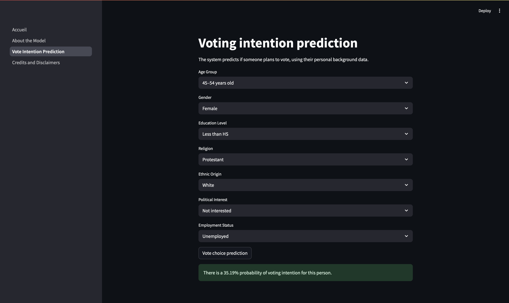

# 🗳️ Prédiction de l'intention de vote – Application éducative

Ce projet est une **application Web développée avec Streamlit** permettant de simuler et d'interpréter l'**intention de vote d’un individu** à partir de variables sociodémographiques clés. Elle repose sur les données des **American National Election Studies (ANES)** et intègre un modèle statistique entraîné pour prédire l’intention de vote via une régression logistique.

---

## 📌 Objectif

Cette WebApp a été développée dans le cadre d’un **projet universitaire en Python**, avec pour objectifs :

* D'explorer la modélisation du comportement électoral,
* De concevoir une application lisible et interprétable avec Streamlit,
* D'appliquer des méthodes statistiques à un jeu de données réel,
* De promouvoir la sensibilisation citoyenne par la simulation.

---

## 📊 Source des données

* **Base de données** : [ANES Time Series – Fichier cumulatif 1948–2020](https://electionstudies.org/data-center/)
* **Échantillon utilisé** : données nettoyées issues de l'enquête de 2020
* **Prétraitement réalisé** :

  * Harmonisation des variables à travers différentes années ANES
  * Fusion de plusieurs colonnes en catégories unifiées (ex. : intérêt politique)
  * Recodage des modalités en valeurs interprétables et exploitables

---

## 📈 Analyse statistique et méthodologie

Plusieurs **analyses statistiques** ont été menées pour identifier les variables explicatives les plus pertinentes :

### ✅ Test d’indépendance du Khi²

* Réalisé pour chaque variable candidate vis-à-vis de la variable cible binaire.
* Variables retenues sur la base d’un **p-value statistiquement significatif (< 0.05)** :

  * `age_group`
  * `sex`
  * `education_level`
  * `religion_grouped`
  * `race_grouped`
  * `employment_status`
  * `political_interest` (consolidée à partir de 8 colonnes ANES)

### ✅ Modélisation

Deux modèles prédictifs ont été entraînés et comparés :

#### 1. **Régression logistique (avec pondération des classes)**

* Meilleur compromis entre interprétabilité et rappel
* Fournit une **probabilité d’intention de vote**
* Modèle utilisé dans l’application finale

#### 2. **Arbre de décision**

* Permet de visualiser les combinaisons explicatives clés
* Confirme l’importance relative de certaines variables (intérêt politique, âge, race)

### 📉 Métriques de performance utilisées

* Accuracy, Precision, Recall, F1-score
* Accent mis sur le **rappel de la classe “a l’intention de voter”** (déséquilibre des classes)

---

## 💡 Fonctionnalités de l’application

* Interface simple et intuitive conçue avec **Streamlit**
* Collecte les caractéristiques suivantes :

  * Tranche d’âge (ex. : 18–24, 25–34...)
  * Sexe
  * Niveau d’éducation
  * Origine ethnique
  * Religion
  * Intérêt pour la politique
  * Statut professionnel
* Affiche **une probabilité (%) d’avoir l’intention de voter**

---

## 🧠 Limites

* Modèle basé sur des données américaines → interprétation à adapter au contexte français
* Projet conçu **à des fins pédagogiques uniquement**, sans valeur prédictive réelle

---

## ⚙️ Technologies utilisées

* Python 3.12
* Streamlit
* pandas, scikit-learn, seaborn, joblib
* Modèle sauvegardé avec `joblib` pour réutilisation

---

## ⚙️ Base de données

anes_db.csv, le jeu de données de base est disponible au lien ci-dessous (étant trop volumineux pour github) :
https://filex-ng.univ-paris1.fr/get?id=a795328a-0944-4ddb-a79b-2dce8014ea05

La source d'origine de la base de données ainsi que les codebooks permettant de déchiffrer la base est le suivant :
https://electionstudies.org/data-center/anes-time-series-cumulative-data-file/

La vidéo de démonstration de l'utilisation de la web app est disponible au lien ci-dessous : 
https://filex-ng.univ-paris1.fr/get?id=1453791e-8580-4767-8a5c-0c8e1d324385

---

## 📁 Structure du projet

```
├── Accueil.py                       # Page d’accueil avec formulaire de prénom
├── 1_À_propos_du_modèle.py          # Explication du modèle
├── 2_Prédiction_intention_vote.py   # Interface principale de prédiction
├── 3_Crédits_et_mentions.py         # Mentions et remerciements
├── assets/logo.png                  # Logo du projet
├── assets/screenshot1.png                  # Capture d'écran de la page de prédiction
├── model_logisticAT.pkl             # Modèle de régression logistique entraîné
├── data & training/codebook_app.pdf            # Document permettant de décoder la base de données
├── data & training/codebook_var.pdf            # Document n°2 permettant de décoder la base de données
├── data & training/data_exploration.ipynb    # Notebook ayant servi à l'entraînement
└── vote_intention_final.csv    # Jeu de données nettoyé


---

## 📸 Aperçu

- Page d’accueil :
  > 


---

## 📬 Contact

Pour toute question ou remarque :
**[Cheikh-Ismael.Coulibaly@etu.univ-paris1.fr](mailto:Cheikh-Ismael.Coulibaly@etu.univ-paris1.fr)**

---

**Enseignant** : *M. Alexis Bogroff*
**Établissement** : *Université Paris 1 Panthéon-Sorbonne*
